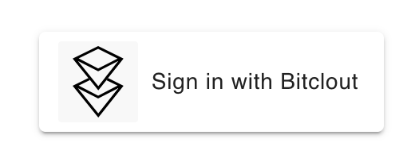

# React BitClout Login

This project is based on [mubashariqbal/login-with-bitclout](https://github.com/mubashariqbal/login-with-bitclout) repository.

[@mubashariqbal](https://bitclout.com/u/mubashariqbal), Thanks a lot for your code!



## Security
This code is very raw and may contain vulnerabilities. I ask you to help make it better. Feel free to add issues and pull requests.

## Instalation

#### npm install
```shell
npm i react-bitclout-login --save
```
#### yarn install
```shell
yarn add react-bitclout-login
```

### JWT
If you only want to verify Bitclout users, JWT token would be enough for this goal.
Storing it in the database is safer than encryptedSeedHex(with high access level) because JWT can't sign Bitclout transactions. You can validate user publicKey by JWT token. See an example here:
https://docs.bitclout.com/devs/identity-api#validation-in-go

## How to use

```js
import './App.css';
import React from "react";
import BitcloutLogin from "react-bitclout-login";
import { makeStyles } from '@material-ui/core/styles';
import LockOpenIcon from '@material-ui/icons/LockOpen';

const useStyles = makeStyles((theme) => ({
  loginButton: {
    backgroundColor: '#FFFFFF',
    textTransform: 'none'
  }
}));

function App() {
  const classes = useStyles();
  const responseClout = (response) => {
    console.log(response)
    /**
    {
        "hasExtraText": false,
        "publicKey": USER_publicKey,
        "btcDepositAddress": USER_btcDepositAddress,
        "encryptedSeedHex": USER_encryptedSeedHex,
        "network": "mainnet",
        "accessLevel":  USER_accessLevel,
        "accessLevelHmac": USER_accessLevelHmac,
        "jwt": USER_jwt
    }
    */
  }
  /**
   * Users can control access level on a per-domain and per-account basis.
   * Read more:
   * https://docs.bitclout.com/devs/identity-api#access-levels
  */
  const accessLevel = 4;
  /**
   * JWT requires access leve 2+
   * Read more:
   * https://github.com/bitclout/identity/blob/main/src/app/identity.service.ts#L115
   * https://github.com/bitclout/identity/blob/main/src/types/identity.ts#L31
   */
  const JWT = true;
  return (
    <div className="App">
      <BitcloutLogin
        accessLevel={accessLevel}
        onSuccess={responseClout}
        onFailure={responseClout}
        JWT={JWT}
        customization={{className: classes.loginButton}}
        // customIcon={<LockOpenIcon/>}
      />
    </div>
  );
}

export default App;
```

Repository install:
```shell
git clone git@github.com:BogdanDidenko/react-bitclout-login.git
cd react-bitclout-login
npm install
npm start
```

Runs the app in the development mode.\
Open [http://localhost:3000](http://localhost:3000) to view it in the browser.

## Developed by [@transhumanist](https://bitclout.com/u/transhumanist)
[](https://bitclout.com/u/transhumanist)